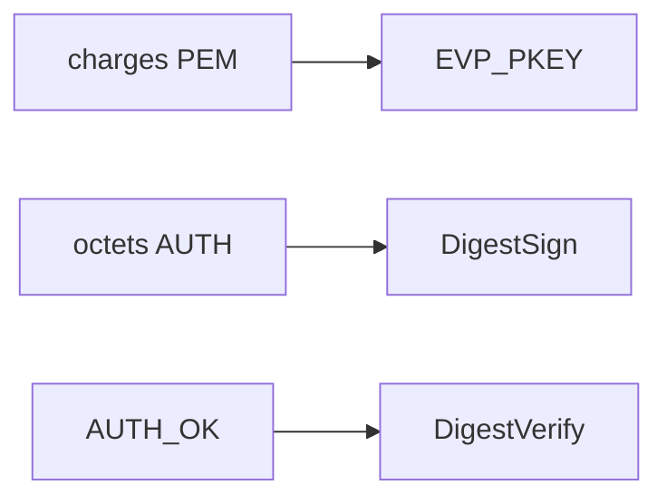

# auth_ed25519.c — carte de lecture

Fichier source : **`src/auth_ed25519.c`** (**61** lignes).  
Chaque **bloc** est un **même cadre ASCII** : d’abord **Lignes** (avec le nombre de lignes entre parenthèses), **Bloc**, **Rôle** ; puis **Explication simple** (**récit** : actions terminal / TP, **pourquoi** ce morceau **à ce moment**) ; si besoin un **sous-tableau à 3 colonnes** ; puis **Cmd**, **Effet**, **Fonct.** — comme `server.md`. **Entre deux blocs** : une ligne `---------------------------------------------------------------------------------`.

**Rôle dans le projet :** Charge **PEM Ed25519** et fournit **`sign` / `verify`** via **EVP OpenSSL** (**messages bruts**, alignement cours **PR6**). Branché derrière **`--signing-key`**, **`--key`**, **`--server-pub`**.



---

## Blocs détaillés

Chaque cadre : **Lignes** / **Bloc** / **Rôle**, puis **Explication simple** (**chronologie TP** : **quand**, **depuis quel terminal**, **après quelle action cliente** — peu de jargon si possible) ; si plusieurs fonctions/étapes, un **sous-tableau à 3 colonnes** (**Fonction** | **Ce qu'elle fait** | **Comment**) ; puis **Cmd**, **Effet**, **Fonct.** — lignes × 110 caractères. Entre blocs : tirets.

```
|------------------------------------------------------------------------------------------------------------|
| Lignes : 1–5 (5)                                                                                           |
| Bloc   : En-tête                                                                                           |
| Rôle   : EVP Ed25519 message brut cours.                                                                   |
|------------------------------------------------------------------------------------------------------------|
| Explication simple : Alignement cours **signature Ed25519** via **EVP OpenSSL cours** (**messages bruts    |
|                      cours** niveau fichier commentaires cours). Ces fonctions **`paroles_*` permettents   |
|                      charger clés PEM binaire raw sign verify client serveur cours option **`--signing-key`|
|                      cours** facultatif.                                                                   |
| Cmd : Optionnel démarrage serveur cliente **avec fichiers PEM** cours.                                     |
| Effet : Expose loaders sign verify cours.                                                                  |
| Fonct. : **include auth header + openssl PEM stdio cours**                                                 |
|------------------------------------------------------------------------------------------------------------|
```

---------------------------------------------------------------------------------

```
|------------------------------------------------------------------------------------------------------------|
| Lignes : 6–28 (23)                                                                                         |
| Bloc   : load PEM private | public                                                                         |
| Rôle   : Charger clés disque cours.                                                                        |
|------------------------------------------------------------------------------------------------------------|
| Explication simple : **Quand** le serveur est lancé avec **`--signing-key fichier.pem`** (ou que le client |
|                      charge **`--server-pub`**), ces fonctions **ouvrent le PEM**, vérifient que c’est bien|
|                      **Ed25519**, et renvoient une **`EVP_PKEY*`** exploitable.                            |
| — Sous-tableau : Fonction │ Ce qu'elle fait │ Comment —                                                    |
| Fonction              │Ce qu'elle fait                         │Comment                                    |
| ──────────────────────│────────────────────────────────────────│───────────────────────────────────────────|
| paroles_load_ed25519_p│Clé privée PEM                          │**PEM_read_PrivateKey** + type.            |
| paroles_load_ed25519_p│Clé publique PEM                        │**PEM_read_PUBKEY** + type.                |
| Cmd : **Initialisation** dans `main` ou après parsing **`argv`** côté client.                              |
| Effet : **Retour** pointeur **`EVP_PKEY`** ou **`NULL`** + libération si mauvais type.                     |
| Fonct. : **fopen** ; **`PEM_read_PrivateKey` / PEM_read_PUBKEY** ; contrôle **`EVP_PKEY_ED25519`**.        |
|------------------------------------------------------------------------------------------------------------|
```

---------------------------------------------------------------------------------

```
|------------------------------------------------------------------------------------------------------------|
| Lignes : 30–32 (3)                                                                                         |
| Bloc   : paroles_ed25519_pubkey_from_cle                                                                   |
| Rôle   : 113 octets → EVP public.                                                                          |
|------------------------------------------------------------------------------------------------------------|
| Explication simple : **Inscription** : partie du client qui **fabrique une clé 113** depuis un PEM **doit  |
|                      aussi pouvoir signer** ensuite ; le serveur vérifie la **portion utile**. Ici         |
|                      **`paroles_ed25519_pubkey_from_cle`** reconstruit l’objet OpenSSL depuis **la zone    |
|                      déjà stockée en octets**.                                                             |
| Cmd : Utilisateurs **fill cle depuis PEM cours** cours.                                                    |
| Effet : **`EVP_PKEY_new_raw_public_key`** avec **32 premiers octets** utiles (les autres sont **padding**  |
|         selon ta branche cours).                                                                           |
| Fonct. : **Construire** une **`EVP_PKEY*`** depuis la **tronche 113** reçue à l’inscription.               |
|------------------------------------------------------------------------------------------------------------|
```

---------------------------------------------------------------------------------

```
|------------------------------------------------------------------------------------------------------------|
| Lignes : 34–48 (15)                                                                                        |
| Bloc   : paroles_ed25519_sign                                                                              |
| Rôle   : Signer buffer cours.                                                                              |
|------------------------------------------------------------------------------------------------------------|
| Explication simple : **Contexte fichier** : **EVP DigestSign avec digest `NULL`** (Ed25519 sur **message   |
|                      brut**). Le client utilise ça avant d’envoyer **AUTH** quand **`--key`** fournit la   |
|                      PEM privée.                                                                           |
| — Sous-tableau : Fonction │ Ce qu'elle fait │ Comment —                                                    |
| Fonction              │Ce qu'elle fait                         │Comment                                    |
| ──────────────────────│────────────────────────────────────────│───────────────────────────────────────────|
| EVP_MD_CTX_new        │Context cours                           │ctx OpenSSL cours                          |
| EVP_DigestSignInit(...│Mode brut Ed25519 cours                 │**NULL digest cours niveau cours**         |
| EVP_DigestSign        │Octets cours                            │écrit cours signature.                     |
| Cmd : Préparation du paquet **AUTH** après lecture du **`nonce`** stocké **`/tmp/paroles_nonce_`** …       |
| Effet : Signature cours écrite buffer **`sig` avec longueur **`siglen` cours.**                            |
| Fonct. : **EVP_MD_CTX_new SignInit DigestSign cours frees ctx cours** erreurs cours                        |
|------------------------------------------------------------------------------------------------------------|
```

---------------------------------------------------------------------------------

```
|------------------------------------------------------------------------------------------------------------|
| Lignes : 50–61 (12)                                                                                        |
| Bloc   : paroles_ed25519_verify                                                                            |
| Rôle   : Vérifier signature cours.                                                                         |
|------------------------------------------------------------------------------------------------------------|
| Explication simple : Vérifications **AUTH ↔ AUTH_OK** : le serveur et le client s’échangent des **messages |
|                      courts** puis **vérifient** la signature adverse avec **`EVP_PKEY` opposée** (**anti- |
|                      usurpation**).                                                                        |
| — Sous-tableau : Fonction │ Ce qu'elle fait │ Comment —                                                    |
| Fonction              │Ce qu'elle fait                         │Comment                                    |
| ──────────────────────│────────────────────────────────────────│───────────────────────────────────────────|
| EVP_MD_CTX_new        │Context cours                           │ctx verify cours                           |
| EVP_DigestVerify      │Compare cours                           │**==1 cours** succes cours                 |
| Cmd : Chemins cours **AUTH / AUTH_OK** cours.                                                              |
| Effet : Retours **`0` ok **`-1` refuse cours.**                                                            |
| Fonct. : **EVP_DigestVerifyInit Verify cours frees ctx cours** compare ok cours                            |
|------------------------------------------------------------------------------------------------------------|
```


---

## Régénérer ces cadres

```bash
cd "$(git rev-parse --show-toplevel 2>/dev/null)/PRCursor/src md"
python3 _gen_src_md.py
```

Voir aussi **`server.md`** (même style, script **`_gen_server_md_blocks.py`**).
