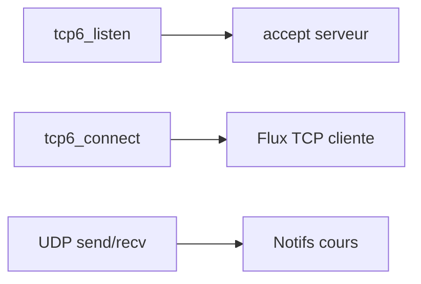

# net.c — carte de lecture

Fichier source : **`src/net.c`** (**136** lignes).  
Chaque **bloc** est un **même cadre ASCII** : d’abord **Lignes** (avec le nombre de lignes entre parenthèses), **Bloc**, **Rôle** ; puis **Explication simple** (**récit** : actions terminal / TP, **pourquoi** ce morceau **à ce moment**) ; si besoin un **sous-tableau à 3 colonnes** ; puis **Cmd**, **Effet**, **Fonct.** — comme `server.md`. **Entre deux blocs** : une ligne `---------------------------------------------------------------------------------`.

**Rôle dans le projet :** **Transport IPv6** : sockets **TCP** (écouter, accepter, connecter), **écritures/ lectures bornées** (**`writen`/`readn`**) avec **timeouts `poll`**, et **UDP** + helpers **multicast** pour les notifications cours.



---

## Blocs détaillés

Chaque cadre : **Lignes** / **Bloc** / **Rôle**, puis **Explication simple** (**chronologie TP** : **quand**, **depuis quel terminal**, **après quelle action cliente** — peu de jargon si possible) ; si plusieurs fonctions/étapes, un **sous-tableau à 3 colonnes** (**Fonction** | **Ce qu'elle fait** | **Comment**) ; puis **Cmd**, **Effet**, **Fonct.** — lignes × 110 caractères. Entre blocs : tirets.

```
|------------------------------------------------------------------------------------------------------------|
| Lignes : 1–8 (8)                                                                                           |
| Bloc   : En-têtes + macro timeout                                                                          |
| Rôle   : `net.h` / includes.                                                                               |
|------------------------------------------------------------------------------------------------------------|
| Explication simple : Ce fichier **`net.c`** branche **`net.h`** où **timeout TCP standard** cours          |
|                      **`PAROLES_TCP_TIMEOUT_MS`** vit avec prototypes **IPv6** sockets. Compilation seule  |
|                      chose exécution — instant **compilation** projet.                                     |
| Cmd : Inclusion avant toute fonction transport.                                                            |
| Effet : **Constante lecture client TLS** commune.                                                          |
| Fonct. : **#include sys/socket polli netinet** etc définitions.                                            |
|------------------------------------------------------------------------------------------------------------|
```

---------------------------------------------------------------------------------

```
|------------------------------------------------------------------------------------------------------------|
| Lignes : 9–54 (46)                                                                                         |
| Bloc   : tcp6_listen | accept | connect                                                                    |
| Rôle   : TCP IPv6 cours.                                                                                   |
|------------------------------------------------------------------------------------------------------------|
| Explication simple : Moment **terminal serveur** : `./paroles_server` **doit être à l’écoute** (**bind +   |
|                      listen**) sur **`::`/ `::1` + port cours**. Moment **terminal client** :              |
|                      **`paroles_client host port`** appelle **`tcp6_connect`**. **`tcp6_accept`** remet le |
|                      **nouveau descripteur** à **`serve_client`**.                                         |
| — Sous-tableau : Fonction │ Ce qu'elle fait │ Comment —                                                    |
| Fonction              │Ce qu'elle fait                         │Comment                                    |
| ──────────────────────│────────────────────────────────────────│───────────────────────────────────────────|
| tcp6_listen           │Écouter adresse cours                   │**bind+listen`** ou fermet.                |
| tcp6_accept           │Nouveau client                          │**accept** POSIX.                          |
| tcp6_connect          │Connexion cliente                       │**connect** vers **`host`** **port htons** |
|                       │                                        │cours.                                     |
| Cmd : Serveur `main` puis client `one_cmd_*` boucles.                                                      |
| Effet : Descripteurs entiers fichiers (**fd**) utilisables ensuite **read/write** ou **TLS**.              |
| Fonct. : **socket AF_INET6** ; erreurs fermetures **close** puis **`-1`** ; **`accept`** simple wrapper    |
|          cours.                                                                                            |
|------------------------------------------------------------------------------------------------------------|
```

---------------------------------------------------------------------------------

```
|------------------------------------------------------------------------------------------------------------|
| Lignes : 56–83 (28)                                                                                        |
| Bloc   : writen | readn                                                                                    |
| Rôle   : Flux octets fiable avec timeout.                                                                  |
|------------------------------------------------------------------------------------------------------------|
| Explication simple : **TCP** transporte bien les octets, mais un seul **`write`** peut être **court** →    |
|                      **`writen` boucle** jusqu’à épuisement (**idiome POSIX**). Pour lire **`n`** octets   |
|                      sans rester aveugle, **`readn` combine `poll`** + **`read`** + **timeout** (cf.       |
|                      fichier : **lecture fragile / connexion fermée**).                                    |
| — Sous-tableau : Fonction │ Ce qu'elle fait │ Comment —                                                    |
| Fonction              │Ce qu'elle fait                         │Comment                                    |
| ──────────────────────│────────────────────────────────────────│───────────────────────────────────────────|
| writen                │Écrit tout                              │**while write** jusqu’à **`n`** octets     |
|                       │                                        │cours.                                     |
| readn                 │Lit tout tout en timeout poll           │**poll POLLIN puis read** jusqu’à **`n`**. |
| Cmd : **`conn_writen` sans TLS fallback** **`writen`**, **`conn_readn` sans TLS utilise `readn`.**         |
| Effet : **`writen`** finit bloc complet ; **`readn`** accumule fragments **avec poll** timeouts.           |
| Fonct. : while (**left**) **write/read** jusqu’à zéro restant sinon **`-1`**.                              |
|------------------------------------------------------------------------------------------------------------|
```

---------------------------------------------------------------------------------

```
|------------------------------------------------------------------------------------------------------------|
| Lignes : 85–96 (12)                                                                                        |
| Bloc   : udp6_send | udp6_recv                                                                             |
| Rôle   : Datagrammes IPv6 + poll.                                                                          |
|------------------------------------------------------------------------------------------------------------|
| Explication simple : UDP **pour les notifs cours** très **court** (**6 octets** code + **`idg`**) envoyés  |
|                      **en multicast ou en unicast**. **`udp6_send`** vérifie que **`sendto`** a bien tout  |
|                      envoyé. **`udp6_recv`** utilise **`poll`** avec **timeout** (ex. client               |
|                      **`listen_udp`** qui attend une **notif d’invite** sur **PORTUDP**).                  |
| — Sous-tableau : Fonction │ Ce qu'elle fait │ Comment —                                                    |
| Fonction              │Ce qu'elle fait                         │Comment                                    |
| ──────────────────────│────────────────────────────────────────│───────────────────────────────────────────|
| udp6_send             │Envoyer datagrammes                     │**sendto`** compare taille cours.          |
| udp6_recv             │Réception timeout                       │**poll** puis **recvfrom**.                |
| Cmd : Serveur **`notif_mcast`** **`notif_udp_user`** cliente **`cmd_listen_udp`** cours.                   |
| Effet : Retour **`0`** envoi bon ou **`int` octets lu** receptions.                                        |
| Fonct. : **sendto** **recvfrom** **poll** cours.                                                           |
|------------------------------------------------------------------------------------------------------------|
```

---------------------------------------------------------------------------------

```
|------------------------------------------------------------------------------------------------------------|
| Lignes : 98–121 (24)                                                                                       |
| Bloc   : join_mcast | udp6_bind_any                                                                        |
| Rôle   : Réception groupe multicast cours.                                                                 |
|------------------------------------------------------------------------------------------------------------|
| Explication simple : Pour **écouter salons multicast** cours (**adresse façon ff0x::**/ports), programme   |
|                      **JOIN_GROUP IPv6 cours** après **bind UDP port groupes** facultatif (`udp6_bind_any` |
|                      **reuse** cours). Tu te places **mémoire cours** après **`NEW_GROUP`** retours        |
|                      **clients** veulent **voir petits pings radio multicast** salons.                     |
| — Sous-tableau : Fonction │ Ce qu'elle fait │ Comment —                                                    |
| Fonction              │Ce qu'elle fait                         │Comment                                    |
| ──────────────────────│────────────────────────────────────────│───────────────────────────────────────────|
| join_mcast            │Joindre le groupe IPv6                  │`struct ipv6_mreq` + `setsockopt`.         |
| udp6_bind_any         │Prise UDP any                           │**socket SOCK_DGRAM** **bind in6addr_any** |
|                       │                                        │cours.                                     |
| Cmd : Client **`listen_mcast`**, serveur constructions **notifications multicast** cours.                  |
| Effet : Socket UDP **bind** puis **abonnement** au groupe.                                                 |
| Fonct. : **setsockopt(IPV6_JOIN_GROUP)** après **`udp6_bind_any`** sur le **port multicast** cours.        |
|------------------------------------------------------------------------------------------------------------|
```

---------------------------------------------------------------------------------

```
|------------------------------------------------------------------------------------------------------------|
| Lignes : 123–137 (15)                                                                                      |
| Bloc   : udp6_mcast_recv_socket                                                                            |
| Rôle   : Conveniences écouter multicast cours.                                                             |
|------------------------------------------------------------------------------------------------------------|
| Explication simple : Helper **combinant lignes cours** précédentes : **traduit textual IPv6**              |
|                      **`mcast_ipv6`**, puis **réutilise **`udp6_bind_any`**, puis **`join_mcast` cours**.  |
|                      **Une ligne API** niveau cours pour clients commandes **`listen_mcast`** **sans épeler|
|                      trois étapes** à chaque démo cours.                                                   |
| Cmd : Client **`listen_mcast` terminal cours** après réception multicast **nouveau salons** cours.         |
| Effet : Retour **`fd`** prêt **`udp6_recv` cours.**                                                        |
| Fonct. : **`inet_pton` → bind → join**, sinon **`close`** en cas d’erreur.                                 |
|------------------------------------------------------------------------------------------------------------|
```


---

## Régénérer ces cadres

```bash
cd "$(git rev-parse --show-toplevel 2>/dev/null)/PRCursor/src md"
python3 _gen_src_md.py
```

Voir aussi **`server.md`** (même style, script **`_gen_server_md_blocks.py`**).
