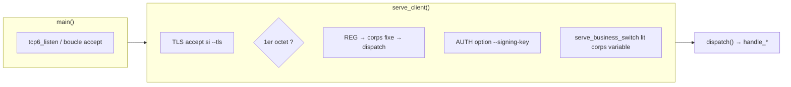

# `server.c` — carte de lecture

Fichier source : **`src/server.c`** (932 lignes).  
Chaque **bloc** est un **même cadre ASCII** : d’abord **Lignes** (avec le nombre de lignes entre parenthèses), **Bloc**, **Rôle** ; puis **Explication simple** (**récit** : deux terminaux ou actions typiques TP, **pourquoi** ce morceau **à ce moment**) ; quand plusieurs fonctions ou étapes se suivent, un **sous-tableau à 3 colonnes** (**Fonction** | **Ce qu’elle fait** | **Comment**) ; puis **Cmd**, **Effet**, **Fonct.** (détail plus technique pour quand tu auras repris une base C).  
**Entre deux blocs** : une ligne `---------------------------------------------------------------------------------`.

**Rappel** : ce serveur **ne fait pas** de `fork()` ni de threads — chaque `accept` est traité **à la suite** dans `serve_client` jusqu’à la fermeture du socket, puis seulement le client suivant est accepté (boucle infinie dans `main`).

**Exemple générique de lancement** (adaptable avec tes variables d’environnement `H` = hôte IPv6, `P` = port) :

```bash
./paroles_server [-v] [--tls cert.pem key.pem] [--signing-key serveur.pem] "$H" "$P"
# Exemples : ./paroles_server "::1" 7777
#             ./paroles_server -v "::" 9000
```

**Autres fichiers `.c`** du même dossier `src/` ont la même mise en page (**cadres 110 caractères**) dans ce répertoire `src md/` : **`wire.md`**, **`net.md`**, **`auth_ed25519.md`**, **`tls_io.md`**, **`client.md`** — commande `python3 _gen_src_md.py` pour les régénérer.

---

## Vue d’ensemble (flux d’une connexion)



- **`REG` (1)** : corps lu en entier dans `serve_client`, puis `dispatch` — **pas** `serve_business_switch`.
- **Avec `--signing-key`** : **première** requête métier = **`AUTH` (0)** → `do_client_auth` / `send_auth_ok`, puis **un second** premier octet = une autre commande dans **la même** connexion TCP.
- **Sinon** : `serve_business_switch` lit le reste selon le `CODEREQ`, puis `dispatch`.

---

## Blocs détaillés

Chaque cadre : **Lignes** / **Bloc** / **Rôle**, puis **Explication simple** (**chronologie TP** : **quand**, **depuis quel terminal**, **après quelle action cliente** — peu de jargon si possible) ; si plusieurs fonctions/étapes, un **sous-tableau à 3 colonnes** (**Fonction** | **Ce qu'elle fait** | **Comment**) ; puis **Cmd**, **Effet**, **Fonct.** — lignes × 110 caractères. Entre blocs : tirets.

```
|------------------------------------------------------------------------------------------------------------|
| Lignes : 1–12 (12)                                                                                         |
| Bloc   : En-têtes                                                                                          |
| Rôle   : Includes stdlib, OpenSSL, proto, wire, net.                                                       |
|------------------------------------------------------------------------------------------------------------|
| Explication simple : Tu ne « vois » rien passer à l’écran quand tu lances `./paroles_server`. Imagine      |
|                      plutôt l’instant **avant** : quand tu as compilé ton projet, le compilateur est passé |
|                      par ces lignes pour savoir **où** sont définies toutes les règles Paroles (noms des   |
|                      commandes, tailles, réseau, TLS). C’est comme la page de garde d’un livre : sans ça le|
|                      reste du fichier ne saurait pas quels mots utilise le protocole. Ce bloc ne raconte   |
|                      aucune histoire client/serveur encore — uniquement les références.                    |
| Cmd : Aucune ligne isolée « exécutée » : tout passe par la compilation qui inclut ces en-têtes.            |
| Effet : Attache la spéc Paroles (paroles_proto.h), auth Ed25519, TLS, modules net/wire, libc/OpenSSL.      |
| Fonct. : Uniquement des #include — pas de if ni de boucle ; tout le fichier utilise ces symboles une fois  |
|          le binaire lancé.                                                                                 |
|------------------------------------------------------------------------------------------------------------|
```

---------------------------------------------------------------------------------

```
|------------------------------------------------------------------------------------------------------------|
| Lignes : 14–16 (3)                                                                                         |
| Bloc   : Variables globales                                                                                |
| Rôle   : verbose, g_io_ssl, g_srv_sign_key.                                                                |
|------------------------------------------------------------------------------------------------------------|
| Explication simple : Tu lances **`./paroles_server …`** une fois : après, tout ce qui arrive sur le réseau |
|                      se joue avec **la même ambiance** tant que tu n’arrêtes pas le programme. Ces trois   |
|                      lignes gardent trois réglages **globaux** : est-ce que le serveur bavarde sur ton     |
|                      terminal (**-v** ou pas), sur **quel lien chiffré** il répond précisément au client   |
|                      qu’il est en train de servir (une prise TLS « courante », pas une par personne tout le|
|                      temps dans la même idée que le cours), et est-ce que le prof t’a demandé une          |
|                      **signature** serveur optionnelle. Tu n’ouvres pas ce bloc au hasard dans la lecture  |
|                      du code : tu y penses quand tu te demandes « pourquoi le serveur parlait tout seul    |
|                      tout à l’heure » ou « où est stockée temporairement la connexion TLS ».               |
| Cmd : Même durée de vie que le processus : après lancement ./paroles_server hôte port (voir exemple bash en|
|       tête du .md).                                                                                        |
| Effet : État partagé : verbose (-v), g_io_ssl pour conn_readn/conn_writen avec TLS, g_srv_sign_key si      |
|         --signing-key.                                                                                     |
| Fonct. : Déclarations static ; g_srv_sign_key initialisée dans main ; g_io_ssl mise au début de            |
|          serve_client puis remise à NULL à la fin.                                                         |
|------------------------------------------------------------------------------------------------------------|
```

---------------------------------------------------------------------------------

```
|------------------------------------------------------------------------------------------------------------|
| Lignes : 18–24 (7)                                                                                         |
| Bloc   : vlog                                                                                              |
| Rôle   : Trace stderr si -v.                                                                               |
|------------------------------------------------------------------------------------------------------------|
| Explication simple : Si tu tapes **`./paroles_server`** sans **`-v`**, le serveur reste discret sur le     |
|                      terminal. Si tu relances avec **`-v`**, alors quand une inscription ou un groupe se   |
|                      crée, il peut **écrire une ligne d’info** sur la sortie erreur (stderr) pour t’aider  |
|                      en TP. Ce bloc dit : « n’affiche que si le mode bavard est activé ». Moment :         |
|                      **après** une action réussie, quand une autre partie du code appelle **`vlog(...)`**. |
| Cmd : ./paroles_server -v "$H" "$P" permet d’afficher ces messages.                                        |
| Effet : Utilitaire de debug avec vfprintf sur stderr.                                                      |
| Fonct. : if (!verbose) return tout de suite ; sinon va_start → vfprintf → va_end.                          |
|------------------------------------------------------------------------------------------------------------|
```

---------------------------------------------------------------------------------

```
|------------------------------------------------------------------------------------------------------------|
| Lignes : 26–75 (50)                                                                                        |
| Bloc   : Constantes + structures                                                                           |
| Rôle   : MAX_*, User, FeedItem, Post, Group.                                                               |
|------------------------------------------------------------------------------------------------------------|
| Explication simple : Pas encore d’« action » : tu es au moment où quelqu’un a dessiné **à quoi ressemble   |
|                      une fiche élève**, une **fiche salon**, un **message**. Quand tout à l’heure dans le  |
|                      cours on dit « l’utilisateur a un pseudo, une clé, plus tard un petit canal UDP où on |
|                      lui envoie une notification courte », ces **structures** donnent cette forme. Maximum |
|                      combien de monde (MAX_*), tout ça évite au programme de mélanger des choux et des     |
|                      poires. Lecture **avant de paniquer** sur les tableaux suivants.                      |
| Cmd : Toute exécution du binaire utilise ces tailles et types pour allouer la RAM.                         |
| Effet : MAX_USERS/MAX_GROUPS/MAX_FEED, etc., et les struct User / FeedItem / Post / Group.                 |
| Fonct. : Que des #define et des struct — aucun if/for ; les realloc plus tard correspondent aux slots      |
|          décrits ici.                                                                                      |
|------------------------------------------------------------------------------------------------------------|
```

---------------------------------------------------------------------------------

```
|------------------------------------------------------------------------------------------------------------|
| Lignes : 77–80 (4)                                                                                         |
| Bloc   : Tables globales                                                                                   |
| Rôle   : users[], groups[], next_uid, next_gid.                                                            |
|------------------------------------------------------------------------------------------------------------|
| Explication simple : Une fois `./paroles_server` parti, tu peux te représenter trois **grandes feuilles**  |
|                      épinglées au mur dans la mémoire du processus : feuille A = qui s’est déjà            |
|                      **inscrit**, feuille B = quel **salon** existe, et deux carnets « quel sera le        |
|                      **prochain numéro** libre ». Chaque fois qu’un TP envoie une commande (s’enregistrer, |
|                      créer un groupe, poster…), tôt ou tard le code descendra **modifier** une ligne sur A |
|                      ou B. Tu ne vois pas les tableaux tout seuls depuis le terminal, mais ils expliquent  |
|                      **tout ce que le serveur « se souvient » tant qu’il tourne**.                         |
| Cmd : Dès qu’un client TCP parle à un ./paroles_server déjà lancé, c’est ces tableaux qui retiennent       |
|       l’état.                                                                                              |
| Effet : « Annuaire » RAM : tous les utilisateurs, tous les groupes, ids à distribuer (next_uid, next_gid). |
| Fonct. : Pas de corps de fonction — tableaux statiques ; ce sont les for des autres fonctions qui les      |
|          balaient.                                                                                         |
|------------------------------------------------------------------------------------------------------------|
```

---------------------------------------------------------------------------------

```
|------------------------------------------------------------------------------------------------------------|
| Lignes : 82–92 (11)                                                                                        |
| Bloc   : find_user, find_group                                                                             |
| Rôle   : Recherche id ; fermés ignorés.                                                                    |
|------------------------------------------------------------------------------------------------------------|
| Explication simple : Scène typique : plus bas dans le fichier, le programme vient de lire « l’utilisateur  |
|                      numéro 7 » ou « le groupe numéro 3 » comme sur ton schéma de cours. Ici ce n’est pas  |
|                      encore une « grande action » : c’est l’**aide-mémoire** qui **retrouve la bonne       |
|                      ligne** dans les listes que le serveur garde en RAM. Pour les groupes, une fois qu’un |
|                      salon est **fermé**, on ne le « voit » plus par ce chemin — comme un carnet barré :   |
|                      plus d’invitation ni de post par là.                                                  |
| — Sous-tableau : Fonction │ Ce qu'elle fait │ Comment —                                                    |
| Fonction              │Ce qu'elle fait                         │Comment                                    |
| ──────────────────────│────────────────────────────────────────│───────────────────────────────────────────|
| find_user             │Retrouve l’utilisateur par uid          │Boucle sur users[] : slot used et id ==    |
|                       │                                        │uid.                                       |
| find_group            │Retrouve un groupe ouvert par idg       │Boucle sur groups[] : used, !closed, idg.  |
| Cmd : Utilisées en interne dès qu’une opération mentionne uid ou idg.                                      |
| Effet : Retournent un pointeur User * ou Group * valide.                                                   |
| Fonct. : for parcourt MAX_USERS ou MAX_GROUPS ; if entrée utilisée et id égale à la valeur ; groupe :      |
|          ajouter if !closed.                                                                               |
|------------------------------------------------------------------------------------------------------------|
```

---------------------------------------------------------------------------------

```
|------------------------------------------------------------------------------------------------------------|
| Lignes : 94–100 (7)                                                                                        |
| Bloc   : cle_is_zero                                                                                       |
| Rôle   : Clé factice (zéros) si ifdef.                                                                     |
|------------------------------------------------------------------------------------------------------------|
| Explication simple : Dans une version du projet où la **vraie clé 113** n’est pas encore exigée à l’examen,|
|                      tu peux envoyer pour l’instant une clé « entièrement remplie de zéros ». Ce morceau   |
|                      vérifie ça : tu ne le visites qu’**au moment inscription** et seulement dans cette    |
|                      branche de compilation. Si plus tard ton sujet demande la vraie clé et que la macro   |
|                      **`PAROLES_ACCEPT_REAL_CLE_113`** est définie, cette vérification peut même           |
|                      disparaître du fichier — donc ne cherche pas ce détail si ton binomial est déjà passé |
|                      à la clé réelle.                                                                      |
| Cmd : Comportement dépend du macro PAROLES_ACCEPT_REAL_CLE_113 à la compilation.                           |
| Effet : Si la macro n’est pas définie : vérifier que la clé 113 est uniquement composée de zéros.          |
| Fonct. : for sur PAROLES_CLE_LEN ; entouré de #ifndef … #endif.                                            |
|------------------------------------------------------------------------------------------------------------|
```

---------------------------------------------------------------------------------

```
|------------------------------------------------------------------------------------------------------------|
| Lignes : 102–130 (29)                                                                                      |
| Bloc   : send_err, send_err_msg, send_ack                                                                  |
| Rôle   : Réponses erreur ou ACK.                                                                           |
|------------------------------------------------------------------------------------------------------------|
| Explication simple : Imagine : le client vient de demander quelque chose, le serveur doit répondre **très  |
|                      court** sur le fil TCP : « erreur générique », « erreur + un petit message texte pour |
|                      le dev », ou « OK reçu » sans en dire plus. Tu n’es pas dans la logique métier ici :  |
|                      c’est l’**enveloppe** que le programme colle sur la prise pour que ton client         |
|                      comprenne « stop » ou « continue ». Ça intervient souvent **juste après** un refus    |
|                      (mauvais paquet) ou **à la fin** d’une commande simple qui n’a pas besoin d’un gros   |
|                      paquet de retour.                                                                     |
| — Sous-tableau : Fonction │ Ce qu'elle fait │ Comment —                                                    |
| Fonction              │Ce qu'elle fait                         │Comment                                    |
| ──────────────────────│────────────────────────────────────────│───────────────────────────────────────────|
| send_err              │Paquet ERR minimal (zéros)              │Buffer 1+ERR_TAIL ; CODEREQ_ERR ;          |
|                       │                                        │conn_writen via g_io_ssl.                  |
| send_err_msg          │ERR avec message courts                 │Si msg vide → send_err ; sinon u16 LE/BE   |
|                       │                                        │selon wire + texte puis envoi.             |
| send_ack              │Acquittement ACK TCP                    │Même gabarit que ERR mais octet CODEREQ_ACK|
|                       │                                        │puis zéros ; conn_writen.                  |
| Cmd : Déclenché quand serve_client passe par err ou lorsqu’un métier doit renvoyer ACK/ERR courte.         |
| Effet : Envoie CODEREQ_ERR (31), ERR contextualisée si besoin et -v, ou CODEREQ_ACK (24).                  |
| Fonct. : send_err : memset puis conn_writen. send_err_msg : if vide → send_err sinon longueur + texte en   |
|          wire.                                                                                             |
|------------------------------------------------------------------------------------------------------------|
```

---------------------------------------------------------------------------------

```
|------------------------------------------------------------------------------------------------------------|
| Lignes : 132–174 (43)                                                                                      |
| Bloc   : Groupe — membres / invitations                                                                    |
| Rôle   : group_* helpers.                                                                                  |
|------------------------------------------------------------------------------------------------------------|
| Explication simple : Pour le serveur, un salon c’est **deux listes simples** : les personnes **déjà        |
|                      dedans** et celles **invitées mais qui n’ont pas encore répondu**. Ces fonctions font |
|                      le secrétariat : est-ce que Untel est membre ? encore en attente ? on l’ajoute, on    |
|                      l’enlève, parfois on agrandit la liste comme un carnet où on rajoute des pages. Moment|
|                      : dès que dans le TP tu enchaînes **INVITE**, **réponse à une invitation** ou         |
|                      **quelqu’un quitte**, c’est **ces listes** qui bougent en coulisses — pas un truc     |
|                      magique depuis le terminal, mais bien la suite logique après une commande cliente.    |
| — Sous-tableau : Fonction │ Ce qu'elle fait │ Comment —                                                    |
| Fonction              │Ce qu'elle fait                         │Comment                                    |
| ──────────────────────│────────────────────────────────────────│───────────────────────────────────────────|
| group_is_member       │Test uid dans membres                   │for sur nmem ; compare mem[i]==uid.        |
| group_is_pending      │Test uid dans invitations               │for sur npend.                             |
| group_add_member      │Ajoute membre sans doublon              │Si déjà membre → return ; realloc×2 si     |
|                       │                                        │plein puis append.                         |
| group_add_pending     │Ajoute invitation pending               │Même schéma que membre avec pend/cpend.    |
| group_remove_pending  │Retire un pending                       │Réécrit pend[] sans l’uid ; met à jour     |
|                       │                                        │npend.                                     |
| group_remove_member   │Retire un membre                        │Réécrit mem[] sans l’uid ; met à jour nmem.|
| Cmd : Au service de handle_invite, handle_inv_ans, handle_new_group, …                                     |
| Effet : Tester appartenances, ajouter/retirer membre ou pending avec réallocation possible.                |
| Fonct. : group_is_* : boucles simples ; group_add_* : if présent alors retour sinon realloc puis append.   |
|------------------------------------------------------------------------------------------------------------|
```

---------------------------------------------------------------------------------

```
|------------------------------------------------------------------------------------------------------------|
| Lignes : 176–182 (7)                                                                                       |
| Bloc   : feed_push                                                                                         |
| Rôle   : Ajout au tableau de fil.                                                                          |
|------------------------------------------------------------------------------------------------------------|
| Explication simple : Scène très concrète : quelqu’un vient **d’écrire un message dans un groupe**          |
|                      (**POST**) ou **de répondre** à un billet (**REPLY**). Dans les deux cas, le serveur  |
|                      ne veut pas « perdre » l’infos pour après — il **rajoute une entrée tout en bas d’un  |
|                      journal** du salon où tout arrive **dans l’ordre du temps**. C’est **`feed_push`** :  |
|                      **copier-coller chronologiquement** « tout à l’heure il s’est passé ça », pour que    |
|                      **plus tard**, une commande « donne-moi la suite après mon dernier point de lecture » |
|                      ait quelque chose à raconter **sans rejouer toute la discussion depuis zéro**.        |
| Cmd : Appelé après création POST ou REPLY pour journaliser chronologiquement le salon.                     |
| Effet : Ajoute un pointeur FeedItem * dans g->feed.                                                        |
| Fonct. : if capacité trop petite → realloc puis feed[nfeed++] = item ; aucune boucle supplémentaire.       |
|------------------------------------------------------------------------------------------------------------|
```

---------------------------------------------------------------------------------

```
|------------------------------------------------------------------------------------------------------------|
| Lignes : 184–212 (29)                                                                                      |
| Bloc   : Notifications UDP                                                                                 |
| Rôle   : notif_mcast + notif_udp_user.                                                                     |
|------------------------------------------------------------------------------------------------------------|
| Explication simple : En parallèle du **gros tuyau TCP** où le client dicte ses commandes au serveur, le    |
|                      cours prévoit de **mini messages UDP** très courts : comme **un bip** (« il y a du    |
|                      nouveau », « invitation », « fermeture »…) **sans tout renvoyer** sur TCP. Une fois   |
|                      `./paroles_server` lancé et les clients configurés comme dans le polycopié, **à       |
|                      certains moments** — par ex. quelqu’un a posté, quelqu’un a été invité, le groupe     |
|                      ferme — le serveur **ouvre vite une prise UDP**, **écrit quelques octets** vers soit  |
|                      **le multicast du groupe** (toute la classe écoute la même radio), soit **une personne|
|                      seule sur le port UDP qu’elle a reçue à l’inscription**, puis ça referme. **Toi lisant|
|                      cette partie** tu te dis : « ah, c’est **là** que le chat “bouge tout seul” côté      |
|                      client sans que j’aie tout retélécharger ».                                           |
| — Sous-tableau : Fonction │ Ce qu'elle fait │ Comment —                                                    |
| Fonction              │Ce qu'elle fait                         │Comment                                    |
| ──────────────────────│────────────────────────────────────────│───────────────────────────────────────────|
| notif_mcast           │Multicast vers tous du salon            │sock UDP ; sockaddr mcast_ip:port groupe ; |
|                       │                                        │pkt 6o (CODEREQ BE + idg) ; fermeture.     |
| notif_udp_user        │Unicast vers un utilisateur             │dst = reg_addr IPv6 avec port udp_port     |
|                       │                                        │utilisateur ; même pkt 6 octets.           |
| Cmd : Lancé automatiquement quand métier doit prévenir sans renvoyer un gros paquet TCP immédiat.          |
| Effet : Vers le multicast du groupe ou vers un utilisateur seul selon les numéros de notif du cours        |
|         (18–23…).                                                                                          |
| Fonct. : socket(AF_INET6, SOCK_DGRAM) → préparer dst → écrire 6 octets en wire → udp6_send → close.        |
|------------------------------------------------------------------------------------------------------------|
```

---------------------------------------------------------------------------------

```
|------------------------------------------------------------------------------------------------------------|
| Lignes : 214–224 (11)                                                                                      |
| Bloc   : find_post, close_group                                                                            |
| Rôle   : Billet ou fermeture salon.                                                                        |
|------------------------------------------------------------------------------------------------------------|
| Explication simple : Deux cas du quotidien TP. **Premier** : ton client veut **répondre au billet numéro   |
|                      5** — le serveur doit **retrouver le bon message en mémoire** avant la suite          |
|                      (**`find_post`**). **Deuxième** : quelqu’un **ferme définitivement le salon**         |
|                      (**`close_group`**) alors le cours demande aussi un **petit ping UDP multicast** («   |
|                      c’est fermé ») pour que tous ceux qui écoutent encore cette adresse groupe            |
|                      **réagissent**. Lis ce bloc quand dans ton sujet tu vois « réponse référencée par     |
|                      numéro » ou « fermeture de groupe avec notif multicast ».                             |
| — Sous-tableau : Fonction │ Ce qu'elle fait │ Comment —                                                    |
| Fonction              │Ce qu'elle fait                         │Comment                                    |
| ──────────────────────│────────────────────────────────────────│───────────────────────────────────────────|
| find_post             │Trouver un billet par numb              │for sur posts[] jusqu’à match numb.        |
| close_group           │Ferme le groupe proprement              │Si déjà closed return ; sinon closed=1 et  |
|                       │                                        │notif_mcast NOTIF_CLOSE.                   |
| Cmd : Utilisation dans REPLY, FEED ou quitter admin (INV_ANS).                                             |
| Effet : Recherche par numb puis marquage fermeture groupe + multicast CLOSE.                               |
| Fonct. : find_post boucle linear ; close_group évite doubles fermetures via if puis notif.                 |
|------------------------------------------------------------------------------------------------------------|
```

---------------------------------------------------------------------------------

```
|------------------------------------------------------------------------------------------------------------|
| Lignes : 226–264 (39)                                                                                      |
| Bloc   : handle_reg                                                                                        |
| Rôle   : CODEREQ 1 — REG.                                                                                  |
|------------------------------------------------------------------------------------------------------------|
| Explication simple : Scène de TP très classique : tu as `./paroles_server` qui tourne, tu lances le client,|
|                      puis **souvent tout commence par « je m’inscris »**. Le programme reçoit **ton        |
|                      pseudo**, **ta zone clé** selon ta version du sujet ; **là où tu dois te placer avec  |
|                      ce bloc**, c’est l’instant où le serveur **choisit encore une ligne libre** dans son  |
|                      tableau interne, **enregistre** « c’est toi », **te donne un numéro stable** (ton     |
|                      **id**), **fixe un petit port UDP d’écoute** avec la formule du cours, **se souvient  |
|                      de l’adresse de ta machine** pour plus tard (les notifs), et **te renvoie sur le fil  |
|                      TCP** un message du type « OK, voici ton numéro et comment on te contactera autrement |
|                      que par le gros tuyau ». Même si tu ne déchiffres pas chaque ligne C, retiens :       |
|                      **commande inscription → ce morceau = la naissance de ton compte côté serveur**.      |
| — Sous-tableau : Fonction │ Ce qu'elle fait │ Comment —                                                    |
| Fonction              │Ce qu'elle fait                         │Comment                                    |
| ──────────────────────│────────────────────────────────────────│───────────────────────────────────────────|
| Garde-fous corps + clé│Refuse si format incorrect              │blen attendu pseudo+113 ; ifndef           |
|                       │                                        │cle_is_zero sinon accept clé PEM.          |
| Recherche slot libre  │Première entrée users[i].unused         │boucle MAX_USERS jusqu’à slot.             |
| Remplir User + ids    │Enregistrer pseudo, udp, peer           │memset slot ; memcpy nom/clé selon ifdef ; |
|                       │                                        │next_uid++; udp_port=(20000+ id%45000);    |
|                       │                                        │reg_addr depuis peer.                      |
| Encoder REG_OK        │Réponse cours avec id/port/clé wire     │wire_put REG_OK, id LE/BE selon cours,     |
|                       │                                        │udp_port, clé.                             |
| conn_writen + vlog    │Envoyer + trace mode -v                 │TLS/TCP ; printf conditionnel utilisateur  |
|                       │                                        │créé.                                      |
| Cmd : Première commande possible d’une connexion : CODEREQ 1 alors que ./paroles_server tourne.            |
| Effet : Crée l’utilisateur, remplit udp_port + reg_addr depuis le peer TCP, renvoie REG_OK avec id + infos |
|         attendues.                                                                                         |
| Fonct. : Vérifie la taille du corps et éventuellement la clé factice ; boucle `for` pour trouver un slot   |
|          libre dans users[] ; initialise la structure ; incrémente les compteurs ; encode la réponse sur le|
|          wire puis `conn_writen` ; `vlog` si `-v`.                                                         |
|------------------------------------------------------------------------------------------------------------|
```

---------------------------------------------------------------------------------

```
|------------------------------------------------------------------------------------------------------------|
| Lignes : 266–305 (40)                                                                                      |
| Bloc   : handle_new_group                                                                                  |
| Rôle   : CODEREQ 3 — salon.                                                                                |
|------------------------------------------------------------------------------------------------------------|
| Explication simple : Tu es **déjà inscrit** et ton client demande **« je crée un nouveau salon »** avec un |
|                      **nom** (longueur variable comme dans le polycopié). **Tout de suite après** cette    |
|                      action, le serveur doit : vérifier que **c’est bien toi** le demandeur, **réserver une|
|                      ligne salon** en mémoire, **choisir un numéro de groupe**, **fabriquer l’adresse      |
|                      multicast** du style **`ff0e::1:<idg>`** vu en cours, **te mettre admin + premier     |
|                      membre**, et **te renvoyer** « voici le numéro du salon, l’adresse radio du groupe, le|
|                      port » pour que **tous les clients** puissent **s’abonner au multicast** correctement.|
|                      Si tu te perds dans le code, repère plutôt **l’ordre du scénario** : **création de    |
|                      salon** sur le client → **ce bloc** = la **naissance du salon** côté serveur.         |
| — Sous-tableau : Fonction │ Ce qu'elle fait │ Comment —                                                    |
| Fonction              │Ce qu'elle fait                         │Comment                                    |
| ──────────────────────│────────────────────────────────────────│───────────────────────────────────────────|
| find_user             │Valider le créateur                     │Pas d’utilisateur → erreur.                |
| wire_get_u16_be       │Longueur + nom variable                 │Lit u16 ; vérifie left ≥ len et len>0 ; q  |
|                       │                                        │pointe sur les octets du nom.              |
| Slot groupe libre     │Premier groups[i] inutilisé             │for MAX_GROUPS ; !used.                    |
| malloc + memcpy       │Stocker le nom                          │chaîne C null-terminated ; admin_id = uid. |
| Construire multicast  │Adresse + port cours                    │snprintf ff0e::1:<idg> puis inet_pton ;    |
|                       │                                        │mcast_port = 30000 + idg%30000.            |
| group_add_member      │Créateur = 1er membre                   │Pas de doublon ; realloc mem si besoin.    |
| wire NEW_GROUP_OK     │Réponse au client                       │idg, port mcast, 16 octets IPv6 binaire.   |
| conn_writen + vlog    │Envoi TCP/TLS                           │retour conn_writen ; trace groupe si -v.   |
| Cmd : Client envoie NEW_GROUP ; le corps TCP a été assemblé avant par `serve_business_switch`, puis        |
|       `dispatch` appelle cette fonction.                                                                   |
| Effet : Nouvelle entrée groupe, nom, paramètres multicast, admin = créateur ; réponse NEW_GROUP_OK au      |
|         format attendu dans le cours.                                                                      |
| Fonct. : `find_user` ; décodage wire du nom ; boucle pour slot libre dans groups[] ; allocations ;         |
|          `inet_pton` ; `group_add_member` ; encodage réponse ; logging optionnel.                          |
|------------------------------------------------------------------------------------------------------------|
```

---------------------------------------------------------------------------------

```
|------------------------------------------------------------------------------------------------------------|
| Lignes : 307–328 (22)                                                                                      |
| Bloc   : handle_invite                                                                                     |
| Rôle   : CODEREQ 5 — INVITE.                                                                               |
|------------------------------------------------------------------------------------------------------------|
| Explication simple : Tu es **admin d’un salon** et depuis le client tu fais **« j’invite telle liste de    |
|                      gens »**. **À ce moment-là** le serveur vérifie d’abord **que tu es bien l’admin**    |
|                      (sinon il refuse dans le même esprit TP qu’un mauvais mot de passe dans un jeu).      |
|                      Ensuite il **parcours chaque invité**, **vérifie qu’il existe encore** sur ce serveur,|
|                      **l’ajoute à la liste d’attente** du groupe, et **déclenche une petite notification   |
|                      UDP** vers cette personne pour qu’elle **voie sans attendre une grosse manip TCP** (« |
|                      tu es attendu dans un groupe » comme dans ta fiche cours). À la fin il te dit **« OK  |
|                      commande prise »** (**ACK**) sur TCP. Narration courte : **INVITE envoyé depuis le    |
|                      terminal client → cette partie du serveur = « mettre tout le monde en attente et les  |
|                      prévenir »**.                                                                         |
| — Sous-tableau : Fonction │ Ce qu'elle fait │ Comment —                                                    |
| Fonction              │Ce qu'elle fait                         │Comment                                    |
| ──────────────────────│────────────────────────────────────────│───────────────────────────────────────────|
| Parse + droits admin  │idg, nb, buffer suffisant               │wire idg/nb ; find_group ; admin_id==uid ; |
|                       │                                        │left ≥ nb×(4+PAD).                         |
| Boucle invités        │Décoder chaque uid                      │wire_get_u32 + wire_expect_zeros PAD ;     |
|                       │                                        │find_user obligatoire.                     |
| group_add_pending     │File d’attente invitation               │Évite doublons ; realloc pend si plein.    |
| notif_udp_user        │Prévenir l’invité en UDP                │NOTIF_INV_UDP + idg vers reg_addr:udp_port.|
| send_ack              │Fin commande OK                         │ACK TCP court.                             |
| Cmd : Serveur déjà lancé + client TCP qui envoie INVITE après s’être identifié comme dans le cours.        |
| Effet : Met à jour pending + notifie chaque invité en UDP + renvoie ACK.                                   |
| Fonct. : Parse idg + nb ; test admin ; boucle `for` sur les invités avec décodage wire,                    |
|          `group_add_pending`, `notif_udp_user`.                                                            |
|------------------------------------------------------------------------------------------------------------|
```

---------------------------------------------------------------------------------

```
|------------------------------------------------------------------------------------------------------------|
| Lignes : 330–371 (42)                                                                                      |
| Bloc   : handle_list_inv                                                                                   |
| Rôle   : CODEREQ 6 — liste d’invitations.                                                                  |
|------------------------------------------------------------------------------------------------------------|
| Explication simple : Tu veux **la liste des salons où on t’a invité mais tu n’as pas encore répondu** : sur|
|                      le client tu envoies la commande **« liste des invitations »** du cours. **Alors** le |
|                      serveur **parcourt tous les salons encore ouverts**, **regarde si ton numéro est      |
|                      encore dans la case « en attente »**, et **construit une réponse** avec nom du salon, |
|                      numéro, pseudo de l’admin, etc. Le programme **prépare un gros buffer** et            |
|                      **l’agrandit** si la liste est longue — toi au terminal tu ne vois pas ça, mais       |
|                      **l’idée** : **question « qu’est-ce qui m’attend ? » → ce bloc répond en listant**.   |
| Cmd : Client LIST_INV (6) sur la connexion TCP cours.                                                      |
| Effet : Construit LIST_INV_OK avec toutes les invitations en attente pour l’utilisateur demandé.           |
| Fonct. : `malloc` puis double boucle sur les groupes avec filtres pending ; `realloc` si besoin ;          |
|          `conn_writen` ; `free`.                                                                           |
|------------------------------------------------------------------------------------------------------------|
```

---------------------------------------------------------------------------------

```
|------------------------------------------------------------------------------------------------------------|
| Lignes : 373–422 (50)                                                                                      |
| Bloc   : handle_inv_ans                                                                                    |
| Rôle   : CODEREQ 8 — réponse invitation.                                                                   |
|------------------------------------------------------------------------------------------------------------|
| Explication simple : Tu as **reçu une invitation** depuis le cours et depuis le client tu envoies **«      |
|                      j’accepte »**, **« je refuse »**, ou **« je quitte le salon »** (parfois **admin      |
|                      contre membre**, ton PDF le détaille). Ce bloc, c’est le **guichet** après ce clic :  |
|                      **refus** = on t’enlève **seulement** de la liste **en attente** ; **acceptation** =  |
|                      tu deviens **membre**, tout le monde reçoit un **signal groupe** du type JOIN comme si|
|                      la porte s’ouvrait ; selon les cas du sujet, **quitter** peut **fermer définitivement |
|                      le salon** ou **juste faire partir une personne** avec les notifications              |
|                      correspondantes. Même sans lire tous les **`if`** en cascade : **après avoir répondu à|
|                      une invitation, c’est ici que le carnet réel bouge**.                                 |
| Cmd : Client INV_ANS après avoir reçu une invitation.                                                      |
| Effet : Met à jour pending/membres, ferme un groupe si nécessaire, notifie le salon en multicast.          |
| Fonct. : Arbre `if` sur la valeur renvoyée ; boucles `for` pour remplir JOIN_OK avec les pseudos présents. |
|------------------------------------------------------------------------------------------------------------|
```

---------------------------------------------------------------------------------

```
|------------------------------------------------------------------------------------------------------------|
| Lignes : 424–458 (35)                                                                                      |
| Bloc   : handle_list_mem                                                                                   |
| Rôle   : CODEREQ 10 — membres.                                                                             |
|------------------------------------------------------------------------------------------------------------|
| Explication simple : **Tu demandes « qui existe encore sur ce serveur » ou « qui est dans CE salon précis  |
|                      »** selon ta commande cours. Si tu envoies **`idg` zéro**, le serveur te répond comme |
|                      un **annuaire global** : tous les pseudos encore valides — pratique pour retrouver les|
|                      numéros avant d’inviter. Si tu envoies **un numéro de groupe**, il liste **les membres|
|                      de ce groupe** mais **seulement si toi tu fais déjà partie** (sinon ça n’a pas de sens|
|                      niveau confidentialité du TP). En clair : commande **liste des membres** sur le client|
|                      → **ce bloc choisit quel mode d’annuaire** te concerne.                               |
| Cmd : Liste des membres d’un groupe ou de tout le monde si idg zéro.                                       |
| Effet : Construit LIST_MEM_OK adapté au mode.                                                              |
| Fonct. : `if idg == 0` alors scan de users[], sinon `find_group` + `group_is_member` puis scan de `mem[]`. |
|------------------------------------------------------------------------------------------------------------|
```

---------------------------------------------------------------------------------

```
|------------------------------------------------------------------------------------------------------------|
| Lignes : 460–500 (41)                                                                                      |
| Bloc   : handle_post                                                                                       |
| Rôle   : CODEREQ 12 — nouveau billet.                                                                      |
|------------------------------------------------------------------------------------------------------------|
| Explication simple : Scène **salon de chat** : quelqu’un tape **un message** dans **un groupe où il a le   |
|                      droit**. **D’abord** le serveur **vérifie** que la personne **fait bien partie** du   |
|                      salon (comme un videur). **Ensuite** il **numérote** le billet, **garde le texte** en |
|                      mémoire, **ajoute une ligne** au **fil d’histoire** vu plus haut (**`feed_push`**),   |
|                      **répond au client** « **message enregistré** » sur TCP, puis **sonne le multicast**  |
|                      (« **y’a du nouveau** ») pour que **toute l’équipe qui écoute la radio du groupe**    |
|                      puisse se mettre à jour **sans** tout retélécharger ligne par ligne depuis le début.  |
| Cmd : Client POST (12).                                                                                    |
| Effet : Ajoute billet et entrée dans le fil du groupe, puis notif multicast NEW_MSG.                       |
| Fonct. : Parse longueurs ; peut-être `realloc` pour posts ; allocations ; `feed_push` ; `conn_writen` ;    |
|          `notif_mcast`.                                                                                    |
|------------------------------------------------------------------------------------------------------------|
```

---------------------------------------------------------------------------------

```
|------------------------------------------------------------------------------------------------------------|
| Lignes : 502–538 (37)                                                                                      |
| Bloc   : handle_reply                                                                                      |
| Rôle   : CODEREQ 14 — réponse au billet.                                                                   |
|------------------------------------------------------------------------------------------------------------|
| Explication simple : Comme dans un **forum** : tu lis un **message numéro tel** et tu cliques **répondre**.|
|                      Le serveur retrouve ce message, **attribue un nouveau numéro** à ta réponse           |
|                      (**`next_reply`** comme un compteur automatique), **ajoute au fil** cette réponse en  |
|                      **chronologie**, **prévient tout le groupe** sur multicast, et **parfois envoie aussi |
|                      un petit signal perso** (**FETCH**) à la personne qui a **écrit le premier message**  |
|                      si **ce n’est pas elle** qui répond — comme **« mets à jour ton affichage sans        |
|                      attendre »**. Si tu ne sais pas lire le reste de la fonction, pose-toi : **j’ai envoyé|
|                      une réponse depuis le client → avant le retour OK, ce passage s’exécute**.            |
| Cmd : Client TCP qui envoie CODEREQ 14 après connexion comme dans le cours.                                |
| Effet : Crée numérotation réponses + FETCH éventuelle vers auteur du billet.                               |
| Fonct. : `find_post` ; increment `next_reply` ; `feed_push` ; condition `notif_udp_user`.                  |
|------------------------------------------------------------------------------------------------------------|
```

---------------------------------------------------------------------------------

```
|------------------------------------------------------------------------------------------------------------|
| Lignes : 540–546 (7)                                                                                       |
| Bloc   : feed_index_after                                                                                  |
| Rôle   : Recherche d’ancre dans le fil.                                                                    |
|------------------------------------------------------------------------------------------------------------|
| Explication simple : **Avant** une grosse commande **« donne-moi la suite du fil »**, le serveur doit      |
|                      **retrouver où il s’était arrêté** pour toi : comme un **marque-page** « j’étais après|
|                      le message X / réponse Y ». Cette **toute petite routine** parcourt le **journal      |
|                      chronologique du groupe** jusqu’à **tomber sur ce couple de numéros**. **Si           |
|                      introuvable**, **plus tard** la commande suivante **dira non** plutôt que d’inventer. |
|                      **Contexte** : tu n’appelles pas cette fonction **depuis le terminal** —              |
|                      **handle_feed** **l’utilise en coulisse** quand **ton client dit « reprends après mon |
|                      dernier souvenir »**.                                                                 |
| Cmd : Utilisée uniquement par `handle_feed`.                                                               |
| Effet : Retrouve index ou signale impossible plus tard dans `handle_feed`.                                 |
| Fonct. : `for i < nfeed` ; comparer `fi->numb` et `fi->numr`.                                              |
|------------------------------------------------------------------------------------------------------------|
```

---------------------------------------------------------------------------------

```
|------------------------------------------------------------------------------------------------------------|
| Lignes : 548–598 (51)                                                                                      |
| Bloc   : handle_feed                                                                                       |
| Rôle   : CODEREQ 16 — lecture du fil.                                                                      |
|------------------------------------------------------------------------------------------------------------|
| Explication simple : Imagine que **ton client était absent** puis **se reconnecte** : au lieu de tout      |
|                      rejouer depuis le début du salon, il envoie **« voici le dernier message / la dernière|
|                      réponse que j’avais vue »**, comme dans le polycopié. **Ce bloc** trouve où ça        |
|                      commence dans **le journal du groupe** et **assemble tout ce qui arrive après** dans  |
|                      une grande réponse. **Par moments** (**selon ta fiche**), il **ajoute encore de       |
|                      petites alertes FETCH en UDP** vers **les personnes qui ont écrit** certains billets, |
|                      pour que **leurs fenêtres** se mettent à jour même si ce n’est **pas elle** qui relit |
|                      en ce moment (**histoire « cache client » niveau cours**). En une phrase si tu lis mal|
|                      le C : **commande FEED = « montre ce que j’ai manqué après mon dernier point de       |
|                      lecture »**.                                                                          |
| Cmd : Client FEED (16).                                                                                    |
| Effet : Sérialise les événements après l’ancre + éventuelles notifs FETCH.                                 |
| Fonct. : `feed_index_after` ; boucle `for` sur la suite ; `realloc` ; `find_post` ; `notif_udp_user`       |
|          conditionnelle ; `free`.                                                                          |
|------------------------------------------------------------------------------------------------------------|
```

---------------------------------------------------------------------------------

```
|------------------------------------------------------------------------------------------------------------|
| Lignes : 600–639 (40)                                                                                      |
| Bloc   : do_client_auth                                                                                    |
| Rôle   : AUTH (0) — preuve d’identité.                                                                     |
|------------------------------------------------------------------------------------------------------------|
| Explication simple : Variante **bonus / prof** : tu lances `./paroles_server` **avec une clé de signature**|
|                      (`--signing-key …`). **La toute première étape « sérieuse »** après la connexion TCP  |
|                      n’est **pas** « inscris-moi » : c’est **« prouve avec un message chiffré que tu es    |
|                      bien le compte untel »**. Concrètement le client envoie une **grosse bribe** lue d’un |
|                      coup ; le serveur retrouve ton compte, vérifie les **numéros anti-rejeu** (**nonce**  |
|                      comme un ticket à usage unique vu en cours), et appelle la **vérification Ed25519**   |
|                      sur un **petit bloc de 9 octets standard**. **Si quoi que ce soit ne colle pas**, la  |
|                      connexion peut **échouer** sans te laisser passer pour un autre utilisateur. Lecture  |
|                      **simple** : **`--signing-key` actif → avant de parler projet normal, passe par ce    |
|                      portique d’identité**.                                                                |
| Cmd : Serveur lancé avec `--signing-key` et client qui commence par AUTH.                                  |
| Effet : Valide signature + nonce et fixe l’identité de session (`sess_uid`).                               |
| Fonct. : Enchaînement de `if` sur les longueurs ; `find_user` ; `paroles_ed25519_verify` ; `EVP_PKEY_free` |
|          ; `auth_nonce++` si OK.                                                                           |
|------------------------------------------------------------------------------------------------------------|
```

---------------------------------------------------------------------------------

```
|------------------------------------------------------------------------------------------------------------|
| Lignes : 641–666 (26)                                                                                      |
| Bloc   : send_auth_ok                                                                                      |
| Rôle   : AUTH_OK (25) signé serveur.                                                                       |
|------------------------------------------------------------------------------------------------------------|
| Explication simple : **Juste après** avoir **été accepté au portique précédent**, le programme **inverse   |
|                      les rôles** : ce n’est plus le client qui se prouve, c’est le **serveur qui signe** un|
|                      message **« vous parlez bien au bon serveur cours »**. Le client pourra contrôler ça  |
|                      avec la **clé publique prof** donnée avec le projet. Narration très courte :          |
|                      **`do_client_auth` OK → ce bloc colle la contre-preuve officielle envoyée au client   |
|                      sur TCP**.                                                                            |
| Cmd : Juste après `do_client_auth` réussi.                                                                 |
| Effet : Envoie AUTH_OK + signature taille fixe attendue.                                                   |
| Fonct. : `paroles_ed25519_sign` ; contrôle longueur ; `wire_put_*` ; `conn_writen`.                        |
|------------------------------------------------------------------------------------------------------------|
```

---------------------------------------------------------------------------------

```
|------------------------------------------------------------------------------------------------------------|
| Lignes : 668–758 (91)                                                                                      |
| Bloc   : dispatch                                                                                          |
| Rôle   : Répartiteur CODEREQ.                                                                              |
|------------------------------------------------------------------------------------------------------------|
| Explication simple : Tu peux voir **`dispatch`** comme **le tableau d’orientation** après qu’une **commande|
|                      TCP complète** a été **rangée en mémoire** (le client a **tout envoyé**, le serveur a |
|                      **tout lu**). **D’abord** une **petite sécurité** : si une **session signée** est     |
|                      active (**option `--signing-key` vue plus haut**), le **corps du message** doit       |
|                      **commencer par le même numéro d’utilisateur** que celui que tu as prouvé — histoire  |
|                      d’**empêcher** « j’agis au nom de **7** alors que je suis **2** ». **Ensuite** un     |
|                      **grand menu `switch`** : « commande inscription → fichier **handle_reg** ; commande  |
|                      groupe → fichier **handle_new_group** ; … », **chaque cas** découpant le buffer comme |
|                      sur la **couche filaire** (`wire_*`). **Moment clé dans ta tête** : **la lecture brute|
|                      est terminée**, **à partir d’ici c’est le « métier » du cours (POST, INVITER, …)**.   |
| Cmd : Chaque requête dont le corps a été complètement lu en RAM.                                           |
| Effet : Vérifie cohérence uid filaire/session puis route vers fonction métier.                             |
| Fonct. : `if (sess_uid && code != REG) … wire_uid …` puis `switch` avec décodages `wire_get_*` ; `default` |
|          → erreur.                                                                                         |
|------------------------------------------------------------------------------------------------------------|
```

---------------------------------------------------------------------------------

```
|------------------------------------------------------------------------------------------------------------|
| Lignes : 760–814 (55)                                                                                      |
| Bloc   : serve_business_switch                                                                             |
| Rôle   : conn_readn puis dispatch.                                                                         |
|------------------------------------------------------------------------------------------------------------|
| Explication simple : Après que le client a envoyé **le tout premier octet** sur TCP, ce premier octet      |
|                      répond déjà à la question « **de quel type de commande on parle ?** » (**POST**,      |
|                      **INVITE**, etc.). **À ce moment** le serveur **ne connaît pas encore le corps        |
|                      complet** du message — comme une étiquette sur une boîte sans avoir encore ouvert tout|
|                      le carton. **Ce bloc** poursuit alors la **lecture au format du cours**, **bout par   |
|                      bout** : pour un POST par exemple une **petite enveloppe puis une taille puis le      |
|                      texte**, pour une INVITE un **nombre** puis pour chaque personne ses **zones fixes**….|
|                      **Une fois tout ce que le polycopié décrit est bien arrivé en mémoire**, **alors**    |
|                      **seulement** il appelle **`dispatch`** pour **faire** **métier**. **Chronologie** :  |
|                      **type de commande reconnu → ce bloc assemble le paquet comme la fiche impose → après |
|                      dispatch**.                                                                           |
| Cmd : **Chaque CODEREQ autre que REG** après avoir lu seulement son premier octet sur la socket TCP.       |
| Effet : Termine de lire le corps variable puis délègue à `dispatch` avec un buffer concaténé.              |
| Fonct. : `switch(code)` ; cas impossible REG → erreur ; chaque cas : lectures successives avec bornes      |
|          (MAX_BODY, nb ≤ 8192) puis `dispatch`.                                                            |
|------------------------------------------------------------------------------------------------------------|
```

---------------------------------------------------------------------------------

```
|------------------------------------------------------------------------------------------------------------|
| Lignes : 816–873 (58)                                                                                      |
| Bloc   : serve_client                                                                                      |
| Rôle   : Session TCP.                                                                                      |
|------------------------------------------------------------------------------------------------------------|
| Explication simple : Tu peux voir **`serve_client`** comme **toute la discussion avec un seul client**     |
|                      après `accept` : **deux fenêtres** de terminal (serveur d’un côté, client de l’autre) |
|                      correspondent à **cet appel tant qu’il n’a pas fini** — comme un **couple au          |
|                      téléphone**, **sans** que le serveur **raccroche puis rappelle le suivant** avant     |
|                      d’avoir terminé (**pas de `fork`**, comme rappelé en introduction de ce fichier).     |
|                      **Ensuite**, selon les options cours : petite **phase TLS** si **`--tls`**, puis soit |
|                      **parcours inscription** direct (**REG** tout de suite), soit **première passe AUTH   |
|                      obligatoire** (**`--signing-key`**), soit **suite de lectures** jusqu’à un message    |
|                      complet puis **`dispatch`**. Si ça dérape, le serveur **renvoie une erreur courte**   |
|                      sur TCP (comme **`send_err`**) et **le client comprend que sa commande est refusée**. |
|                      **Sans lire le C** : **tant que la connexion avec cet utilisateur vit, c’est tout le «|
|                      film » de `serve_client`**.                                                           |
| Cmd : Établissement de session pour chaque client connecté depuis `./paroles_server "$H" "$P"` (éventuelle |
|       option TLS courante cours).                                                                          |
| Effet : Enchaîne TLS, REG, AUTH forcée ou commande métier + gestion erreur.                                |
| Fonct. : `if tls_ctx … SSL_accept` ; branche REG ; bloc `if (g_srv_sign_key)` pour AUTH puis relecture ;   |
|          sinon `serve_business_switch` ; `goto err`/`end`.                                                 |
|------------------------------------------------------------------------------------------------------------|
```

---------------------------------------------------------------------------------

```
|------------------------------------------------------------------------------------------------------------|
| Lignes : 875–932 (58)                                                                                      |
| Bloc   : main                                                                                              |
| Rôle   : Point d’entrée.                                                                                   |
|------------------------------------------------------------------------------------------------------------|
| Explication simple : Tu es **sous Linux dans un terminal** et tu tapes **`./paroles_server …`** puis Entrée|
|                      : **c’est exactement l’entrée `main`**. **D’abord** le programme **lit ce que tu as   |
|                      écrit** (**mode bavard **`-v`** ?**, **`--tls`** ?, **`--signing-key`** ?, **quel hôte|
|                      IPv6 écouter**, **quel port**). **Ensuite** il **ouvre la « porte d’entrée » réseau** |
|                      (`tcp6_listen`) et souvent **t’indique où il attend** — pratique pour **recopier la   |
|                      même adresse et le même port** dans un **second terminal où tu lanceras le client**.  |
|                      **Après** c’est une **boucle infinie** classique TP : **`accept`** **pour un client   |
|                      qui arrive**, **`serve_client` pour finir toute la conversation avec lui**, **puis    |
|                      encore `accept`** pour le suivant (**un par un**, **pas plusieurs en même temps avec  |
|                      ce fichier**). **Si** **`accept` rate pour un problème réseau passager**, **la boucle |
|                      fait `continue` et le programme continue d’attendre.** **Une phrase finale** sans     |
|                      jargon : **la ligne que tu tapes pour lancer `./paroles_server`, c’est le début du    |
|                      film — ouverture de l’écoute puis file d’attente des élèves**.                        |
| Cmd : Lancement du binaire `paroles_server` depuis le terminal comme dans l’exemple bash en tête de ce     |
|       fichier.                                                                                             |
| Effet : Transforme ligne de commande en socket IPv6 puis file d’attente de clients séquentiels.            |
| Fonct. : Parse `argc/argv`, messages d’erreur si incomplet ; `tcp6_listen` ; `for (;;)` avec `tcp6_accept` |
|          → `serve_client`.                                                                                 |
|------------------------------------------------------------------------------------------------------------|
```

---

## Schéma « qui appelle quoi »

```
main
 └─ tcp6_accept → serve_client
       ├─ dispatch(REG)  (corps déjà lu)
       ├─ do_client_auth + send_auth_ok  (si --signing-key)
       └─ serve_business_switch → dispatch → handle_reg | handle_new_group | … | handle_feed
```

Les **`handle_*`** s’appuient sur : **`find_user` / `find_group`**, **`group_*`**, **`feed_push`**, **`notif_mcast`**, **`notif_udp_user`**, **`find_post`**, **`close_group`**, **`send_err`**, **`send_ack`**, etc.

---

## Note

- Document **navigation** ; le détail normatif reste **`projet_PR6.pdf`** et **`include/paroles_proto.h`**.
- Si tu modifies **`server.c`**, les plages **Lignes** et les **(n)** peuvent être régénérées ou ajustées.
