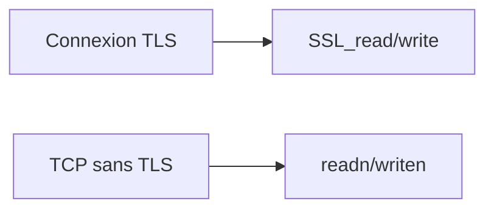

# tls_io.c — carte de lecture

Fichier source : **`src/tls_io.c`** (**120** lignes).  
Chaque **bloc** est un **même cadre ASCII** : d’abord **Lignes** (avec le nombre de lignes entre parenthèses), **Bloc**, **Rôle** ; puis **Explication simple** (**récit** : actions terminal / TP, **pourquoi** ce morceau **à ce moment**) ; si besoin un **sous-tableau à 3 colonnes** ; puis **Cmd**, **Effet**, **Fonct.** — comme `server.md`. **Entre deux blocs** : une ligne `---------------------------------------------------------------------------------`.

**Rôle dans le projet :** Crée **`SSL_CTX` serveur ou client**, puis **`conn_readn` / `conn_read_upto` / `conn_writen`** qui **marchent aussi sans TLS** (délégation **`readn`/`writen`** depuis **`net.c`**).



---

## Blocs détaillés

Chaque cadre : **Lignes** / **Bloc** / **Rôle**, puis **Explication simple** (**chronologie TP** : **quand**, **depuis quel terminal**, **après quelle action cliente** — peu de jargon si possible) ; si plusieurs fonctions/étapes, un **sous-tableau à 3 colonnes** (**Fonction** | **Ce qu'elle fait** | **Comment**) ; puis **Cmd**, **Effet**, **Fonct.** — lignes × 110 caractères. Entre blocs : tirets.

```
|------------------------------------------------------------------------------------------------------------|
| Lignes : 1–5 (5)                                                                                           |
| Bloc   : En-têtes                                                                                          |
| Rôle   : Bridger OpenSSL avec net cours.                                                                   |
|------------------------------------------------------------------------------------------------------------|
| Explication simple : Relie fichiers cours **`tls_io.h` cours** définitions cours avec **`conn_readn`       |
|                      cours** cours — include **`net.h` cours poll unistd cours permettentes boucles cours  |
|                      **sans dupliquer** lowlevel POSIX cours niveau cours.                                 |
| Cmd : Compilation cours modules serveur cliente TLS cours                                                  |
| Effet : **Prototypes cours OpenSSL cours** cours.                                                          |
| Fonct. : **include cours**                                                                                 |
|------------------------------------------------------------------------------------------------------------|
```

---------------------------------------------------------------------------------

```
|------------------------------------------------------------------------------------------------------------|
| Lignes : 6–18 (13)                                                                                         |
| Bloc   : paroles_tls_server_ctx                                                                            |
| Rôle   : Context serveur cours.                                                                            |
|------------------------------------------------------------------------------------------------------------|
| Explication simple : Quand prof **`--tls cert key** cours `./paroles_server` cours** charge certificats PEM|
|                      cours configure **TLS≥1 cours** niveau cours — **checks private key cours** cours     |
|                      cohérences cours cours.                                                               |
| — Sous-tableau : Fonction │ Ce qu'elle fait │ Comment —                                                    |
| Fonction              │Ce qu'elle fait                         │Comment                                    |
| ──────────────────────│────────────────────────────────────────│───────────────────────────────────────────|
| SSL_CTX_use_certificat│Charge le cert PEM                      │fichier + type PEM.                        |
| SSL_CTX_use_PrivateKey│Charge la clé privée                    │fichier + type PEM.                        |
| SSL_CTX_check_private_│Vérifie la paire cert/clé               │retour booléen OpenSSL.                    |
| Cmd : Serveur `main cours` initialisations cours.                                                          |
| Effet : **SSL_CTX* cours cours** ou erreur cours fermet cours.                                             |
| Fonct. : **SSL_CTX_new TLS_server_method cours Certificates PrivateKey cours** check cours cours           |
|------------------------------------------------------------------------------------------------------------|
```

---------------------------------------------------------------------------------

```
|------------------------------------------------------------------------------------------------------------|
| Lignes : 20–31 (12)                                                                                        |
| Bloc   : paroles_tls_client_ctx                                                                            |
| Rôle   : Context client cours CA.                                                                          |
|------------------------------------------------------------------------------------------------------------|
| Explication simple : Cliente **`paroles_client --tls ca.pem cours` charge magasin confiance cours** avec   |
|                      **verification peer cours** cours — **vérif cours** certificats serveur cours pendant |
|                      **`SSL_connect` cours**.                                                              |
| Cmd : Arguments **`--tls` cliente cours**.                                                                 |
| Effet : **SSL_CTX* cours** chargé CA cours.                                                                |
| Fonct. : **SSL_CTX_load_verify_locations cours set_verify PEER cours** TLS1_2 minimum cours                |
|------------------------------------------------------------------------------------------------------------|
```

---------------------------------------------------------------------------------

```
|------------------------------------------------------------------------------------------------------------|
| Lignes : 33–35 (3)                                                                                         |
| Bloc   : paroles_tls_ctx_free                                                                              |
| Rôle   : Libération mémoire cours.                                                                         |
|------------------------------------------------------------------------------------------------------------|
| Explication simple : Petit wrapper **`SSL_CTX_free` cours niveau cours** pour **`atexit cours` fichier     |
|                      **`client cours` fermet contexts cours** cours propres fermet cours.                  |
| Cmd : Fin cours processus cours ou erreurs cours init cours.                                               |
| Effet : Libération OpenSSL cours.                                                                          |
| Fonct. : if ctx SSL_CTX_free cours                                                                         |
|------------------------------------------------------------------------------------------------------------|
```

---------------------------------------------------------------------------------

```
|------------------------------------------------------------------------------------------------------------|
| Lignes : 37–93 (57)                                                                                        |
| Bloc   : conn_readn | conn_read_upto                                                                       |
| Rôle   : Lecture TLS ou clair cours.                                                                       |
|------------------------------------------------------------------------------------------------------------|
| Explication simple : **Cœur pratiques cours TLS** cours : si **`ssl` NULL cours** alors **delegue `readn`  |
|                      net cours timeouts POSIX cours sinon boucle `SSL_read` cours** gères **`WANT_READ`    |
|                      WANT_WRITE cours** cours avec **`poll` cours timeouts cours** — comportements non     |
|                      bloquantes cours cours. **`conn_read_upto` cours** usages messages **dont tail fin    |
|                      variable cours** cours — **boucle cours** jusqu'à timeout cours ou cap cours ou       |
|                      **SSL_ERROR_ZERO_RETURN cours**.                                                      |
| — Sous-tableau : Fonction │ Ce qu'elle fait │ Comment —                                                    |
| Fonction              │Ce qu'elle fait                         │Comment                                    |
| ──────────────────────│────────────────────────────────────────│───────────────────────────────────────────|
| conn_readn            │Exactement n octets cours               │**SSL_read loop WANT_* cours**             |
| conn_read_upto        │Jusqu’à capacité ou fin                 │**SSL_ERROR_ZERO_RETURN** ou timeout.      |
| Cmd : Serveur **`serve_business_switch` cliente `one_cmd_*` cours**.                                       |
| Effet : Octets lus buffer cours retour longueur cours.                                                     |
| Fonct. : **SSL_read poll SSL_ERROR cours** ou **read fallback cours**.                                     |
|------------------------------------------------------------------------------------------------------------|
```

---------------------------------------------------------------------------------

```
|------------------------------------------------------------------------------------------------------------|
| Lignes : 95–120 (26)                                                                                       |
| Bloc   : conn_writen                                                                                       |
| Rôle   : Écriture TLS ou net cours.                                                                        |
|------------------------------------------------------------------------------------------------------------|
| Explication simple : **Symétrique écrit cours** cours : **`SSL_write` cours retries WANT_WRITE WANT_READ   |
|                      cours** avec **`poll` cours timeouts `PAROLES_TCP_TIMEOUT_MS` cours** cours — fallback|
|                      **`writen` cours lorsque pas TLS cours**.                                             |
| Cmd : Toutes réponses serveur cours messages cliente cours cours.                                          |
| Effet : Envoie intégralité buffer cours cours.                                                             |
| Fonct. : **SSL_write** en boucle avec **`poll`** (**WANT_WRITE / WANT_READ**) ou **`writen`** si **`ssl`** |
|          absent.                                                                                           |
|------------------------------------------------------------------------------------------------------------|
```


---

## Régénérer ces cadres

```bash
cd "$(git rev-parse --show-toplevel 2>/dev/null)/PRCursor/src md"
python3 _gen_src_md.py
```

Voir aussi **`server.md`** (même style, script **`_gen_server_md_blocks.py`**).
