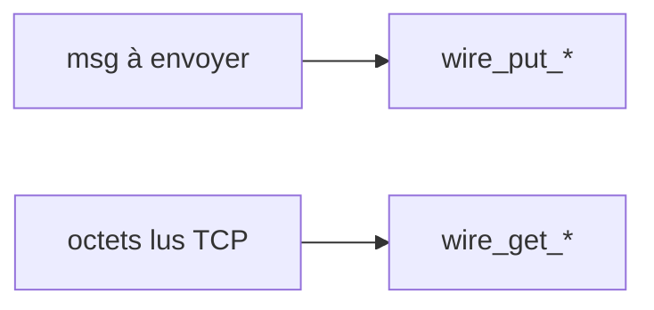

# wire.c — carte de lecture

Fichier source : **`src/wire.c`** (**55** lignes).  
Chaque **bloc** est un **même cadre ASCII** : d’abord **Lignes** (avec le nombre de lignes entre parenthèses), **Bloc**, **Rôle** ; puis **Explication simple** (**récit** : actions terminal / TP, **pourquoi** ce morceau **à ce moment**) ; si besoin un **sous-tableau à 3 colonnes** ; puis **Cmd**, **Effet**, **Fonct.** — comme `server.md`. **Entre deux blocs** : une ligne `---------------------------------------------------------------------------------`.

**Rôle dans le projet :** Encodage/décodage **big-endian** des entiers et des zones de **zéros** utilisés dans tous les paquets Paroles (**serveur et client**).



---

## Blocs détaillés

Chaque cadre : **Lignes** / **Bloc** / **Rôle**, puis **Explication simple** (**chronologie TP** : **quand**, **depuis quel terminal**, **après quelle action cliente** — peu de jargon si possible) ; si plusieurs fonctions/étapes, un **sous-tableau à 3 colonnes** (**Fonction** | **Ce qu'elle fait** | **Comment**) ; puis **Cmd**, **Effet**, **Fonct.** — lignes × 110 caractères. Entre blocs : tirets.

```
|------------------------------------------------------------------------------------------------------------|
| Lignes : 1–18 (18)                                                                                         |
| Bloc   : wire_put_* BE                                                                                     |
| Rôle   : Écrire u8,u16,u32 dans un tampon mémoire.                                                         |
|------------------------------------------------------------------------------------------------------------|
| Explication simple : Tu **construis un paquet** Paroles comme une **liste d’octets** dans un tableau C.    |
|                      Chaque fois que le cours impose **grand-boutiste (big-endian)** sur 16 ou 32 bits, ces|
|                      trois **`wire_put_*`** avancent le curseur **`p`** (**double pointeur**).             |
| — Sous-tableau : Fonction │ Ce qu'elle fait │ Comment —                                                    |
| Fonction              │Ce qu'elle fait                         │Comment                                    |
| ──────────────────────│────────────────────────────────────────│───────────────────────────────────────────|
| wire_put_u8           │1 octet brut                            │**p avance**, stocke v.                    |
| wire_put_u16_be       │16 bits BE                              │**p += 2** octets haut puis bas.           |
| wire_put_u32_be       │32 bits BE                              │**p += 4** même idée cours.                |
| Cmd : Chaque fois que `server.c` ou `client.c` **encode un message avant `conn_writen`**.                  |
| Effet : Avance **`p`** de 1 / 2 / 4 octets avec les valeurs bien rangées (**MSB first** pour 16 et 32).    |
| Fonct. : Écrit octet **`v`** puis pour u16/u32 découpe bitwise `>>` puis masque `0xff`.                    |
|------------------------------------------------------------------------------------------------------------|
```

---------------------------------------------------------------------------------

```
|------------------------------------------------------------------------------------------------------------|
| Lignes : 20–42 (23)                                                                                        |
| Bloc   : wire_get_*                                                                                        |
| Rôle   : Lire depuis buffer + compteur `left`.                                                             |
|------------------------------------------------------------------------------------------------------------|
| Explication simple : Maintenant **le sens inverse** (**décoder**) : tu reçois un **bout de paquet** déjà   |
|                      dans la RAM après lecture TCP (**`resp` cours**) et **`left`** dit **combien d’octets |
|                      il reste valides**. **Si quelqu’un tronque** le paquet (**left trop petit**), ces     |
|                      fonctions retournent **-1 au lieu d’inventer une valeur** (**garde cours** TP). Tu    |
|                      avances **`p`** et décrémentes **`left`** comme le polycopié pour **parcourir le fil  |
|                      wire** ligne par ligne.                                                               |
| — Sous-tableau : Fonction │ Ce qu'elle fait │ Comment —                                                    |
| Fonction              │Ce qu'elle fait                         │Comment                                    |
| ──────────────────────│────────────────────────────────────────│───────────────────────────────────────────|
| wire_get_u8           │Lecture 8 bits                          │**left≥1 sinon -1**, avance curseur.       |
| wire_get_u16_be       │Lecture 16 bits BE                      │**left≥2 sinon -1**.                       |
| wire_get_u32_be       │Lecture 32 bits BE                      │**left≥4 sinon -1**.                       |
| Cmd : Parsage des réponses (`REG_OK`, `NEW_GROUP_OK`, liste invitations…) après lecture TCP (**`conn_readn`|
|       / lecture complète cours**).                                                                         |
| Effet : **`out`** reçoit valeur ou **erreur `-1`** ; **`p`** et **`left`** mis à jour quand ça passe.      |
| Fonct. : Lit 1 / 2 / 4 octets ; compare **`*left`** ; reconstruits shifts OR.                              |
|------------------------------------------------------------------------------------------------------------|
```

---------------------------------------------------------------------------------

```
|------------------------------------------------------------------------------------------------------------|
| Lignes : 44–55 (12)                                                                                        |
| Bloc   : wire_put_zeros, wire_expect_zeros                                                                 |
| Rôle   : Padding / zones à zéro.                                                                           |
|------------------------------------------------------------------------------------------------------------|
| Explication simple : **Deux aides** très **fréquentes** quand cours impose **pseudo fixe bourré zéros** ou |
|                      **`PAROLES_INV_PAD`**. **`wire_put_zeros`** remplit vite une zone (**comme crayon     |
|                      tampon noir** mémoires). **`wire_expect_zeros`** **vérifie** qu’en lecture **couche   |
|                      reste encore zéros** (**sinon -1**) — très **pratique** pour **INVITE cours** où      |
|                      **zones réservées** doivent **rester neutres**.                                       |
| Cmd : Utilisées partout inscription sans vraie clé (clé bourrées), invites avec padding lisible cours.     |
| Effet : Écrit un bloc de **`n`** zéros **ou** vérifie consommation **`n`** zéros et avance **`p`**.        |
| Fonct. : memset + avance **`p`** ; boucle **`for`** **compare octet après octet lors parse.                |
|------------------------------------------------------------------------------------------------------------|
```


---

## Régénérer ces cadres

```bash
cd "$(git rev-parse --show-toplevel 2>/dev/null)/PRCursor/src md"
python3 _gen_src_md.py
```

Voir aussi **`server.md`** (même style, script **`_gen_server_md_blocks.py`**).
